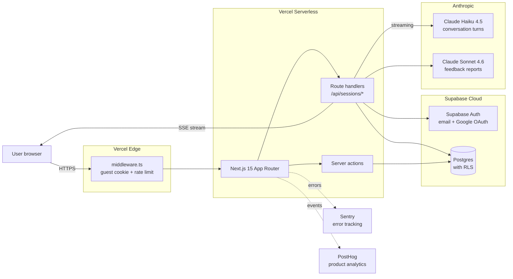
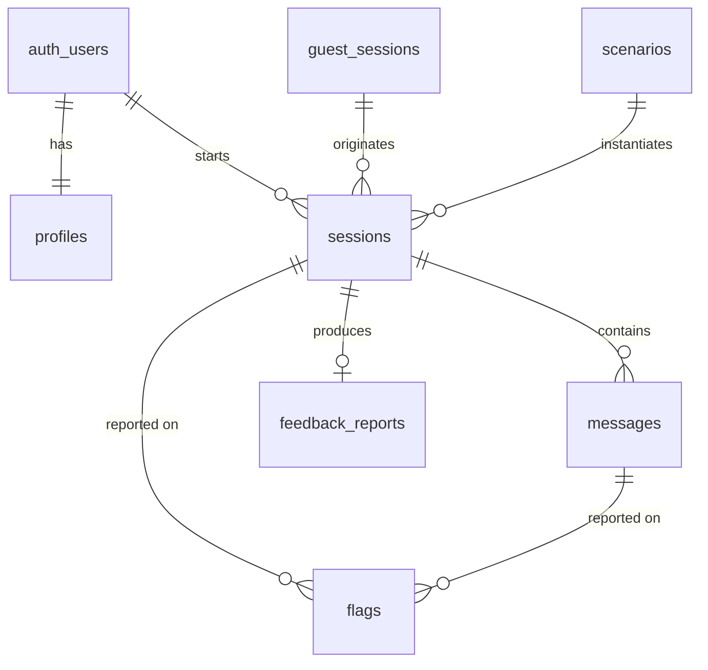
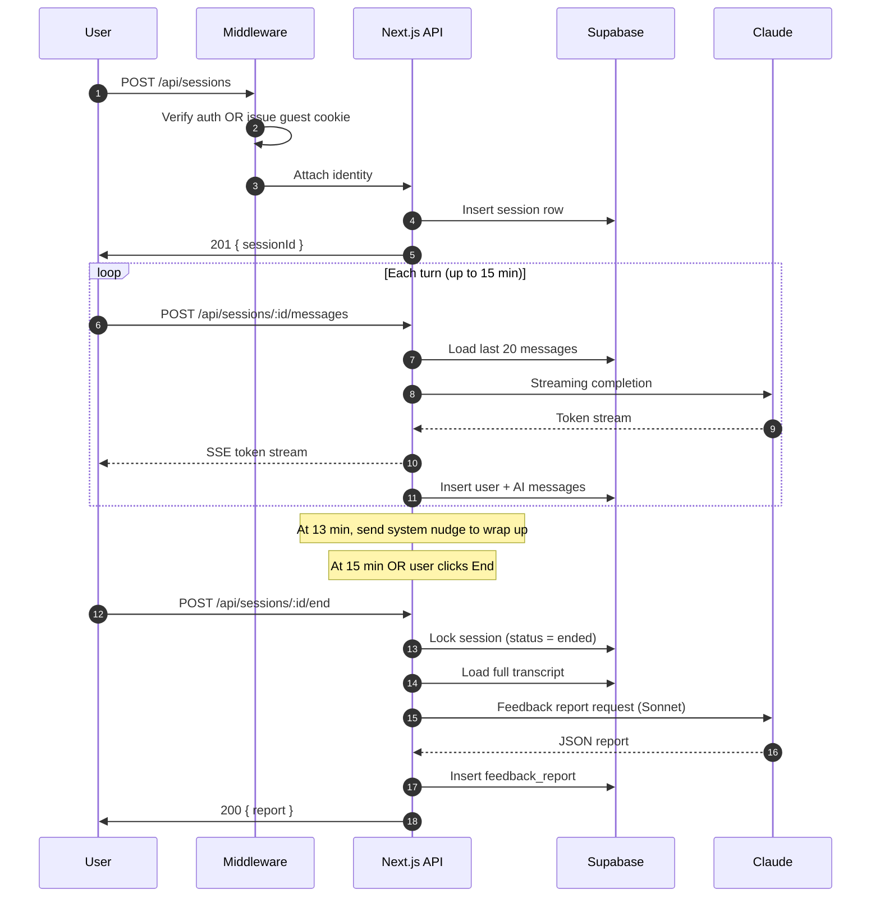

# 03 — Architecture (v0.1)

**Version:** 0.1-draft
**Status:** Draft — under review
**Last updated:** 2026-09-17
**Owner:** Prashrijan Shrestha
**Depends on:** [01-scope.md](01-scope.md), [02-requirements.md](02-requirements.md)

This document defines *how* OpenMic v0.1 is built. Every technical decision that lands in a PR should be traceable to this document (or a superseding ADR in `decisions/`).

The goal is not to be exhaustive — the goal is to make every significant technical decision *explicit* before implementation, so future changes are informed and not accidental.

---

## Table of Contents

1. [Executive summary](#1-executive-summary)
2. [High-level architecture](#2-high-level-architecture)
3. [Deployment topology](#3-deployment-topology)
4. [Data model](#4-data-model)
5. [Auth & session identity](#5-auth--session-identity)
6. [API surface](#6-api-surface)
7. [LLM integration](#7-llm-integration)
8. [Session lifecycle](#8-session-lifecycle)
9. [Rate limiting](#9-rate-limiting)
10. [Observability](#10-observability)
11. [Security](#11-security)
12. [Cost model](#12-cost-model)
13. [Environments & configuration](#13-environments--configuration)
14. [Migration strategy](#14-migration-strategy)
15. [Trade-offs & open decisions](#15-trade-offs--open-decisions)
16. [Traceability](#16-traceability)

---

## 1. Executive summary

OpenMic v0.1 is a Next.js 15 web application deployed on Vercel, with Supabase (Postgres + Auth) as the durable backing store, Anthropic Claude as the language model, and Sentry + PostHog for observability. There is no separate backend service — server-side logic lives in Next.js route handlers and server actions, keeping the deployment surface small.

The most consequential architectural decisions:

- **All LLM traffic is proxied server-side.** The Anthropic API key never touches the browser. This is non-negotiable for security (NFR-3.1) and lets us enforce rate limits and log costs before the model call.
- **Guest identity uses HMAC-signed cookies, not IP addresses or fingerprinting.** IPs are shared (offices, mobile carriers) and fingerprinting is fragile. A signed cookie is durable per browser and cheap to verify.
- **Two Claude models, split by workload.** `claude-haiku-4-5` for conversation turns (cheap, fast) and `claude-sonnet-4-6` for end-of-session feedback reports (better reasoning for the one place quality matters most). This is what makes the ≤$0.05/session cost target (NFR-8.1) tractable.
- **Streaming responses use Server-Sent Events (SSE) over a plain fetch stream**, not WebSockets. SSE is one-way (server → client), which is exactly what we need. It survives serverless boundaries and requires no persistent connections.
- **Supabase Row-Level Security (RLS) is the primary access control.** Every user-owned table has policies enforcing `user_id = auth.uid()`. There is no application-level auth check that isn't also enforceable at the database.

## 2. High-level architecture



**Reading the diagram.** All traffic enters through Vercel's edge middleware, which handles two concerns: issuing/verifying the guest cookie and applying rate limits. Requests then hit either static assets, page components, or API route handlers. API routes talk to Supabase for persistence and auth, and to Anthropic for language. The client receives streamed AI responses over SSE. Sentry and PostHog receive out-of-band telemetry.

**What's deliberately absent.** No Redis, no message queue, no separate worker service, no cache layer, no CDN besides Vercel's built-in edge cache. Every one of those is a tempting addition and every one of them adds operational cost we can't justify at 5–10 hours/week. When we outgrow this shape, we'll add them one at a time with an ADR each.

## 3. Deployment topology

| Concern | Choice | Why |
|---|---|---|
| **Frontend + API** | Vercel (Hobby → Pro when scale demands) | Zero-config Next.js hosting, preview deploys per PR, generous free tier |
| **Database + Auth** | Supabase Cloud (Free → Pro) | Managed Postgres with excellent RLS support, Auth solves email magic link + OAuth without custom code |
| **LLM** | Anthropic API direct | No middleman; SDK is stable; prompt caching is a first-party feature |
| **Error tracking** | Sentry (Free tier: 5k errors/month) | Best-in-class SDK for Next.js, works for both client and server |
| **Product analytics** | PostHog Cloud (Free tier: 1M events/month) | Self-serve, no cookies required, autocapture opt-out for privacy |
| **DNS + Domain** | Cloudflare Registrar or Namecheap → CNAME to Vercel | Cheapest reasonable registrar; Cloudflare is honest about pricing |
| **CI** | GitHub Actions (default for public repos, free) | Runs lint + typecheck + unit tests on every PR |
| **Preview environments** | Vercel preview deploys per PR | Every PR gets a live URL wired to a staging Supabase project |

**Regions.** Vercel serverless functions default to `iad1` (US East, Washington DC). Supabase project region should match — start with `us-east-1`. If most users end up outside North America, we revisit; regional migration on Supabase is non-trivial so we make this choice deliberately at launch.

## 4. Data model

Full Postgres schema. This is the authoritative reference; the actual migrations live at `supabase/migrations/`.

### 4.1 Entity-relationship diagram



### 4.2 Tables

#### `profiles`
Extends `auth.users` (Supabase-managed). 1:1 relationship.

```sql
create table profiles (
  id uuid primary key references auth.users(id) on delete cascade,
  display_name text,
  practice_goals text[] not null default '{}'
    check (cardinality(practice_goals) <= 5),
  preferred_feedback_mode text not null default 'natural'
    check (preferred_feedback_mode in ('natural', 'coach')),
  age_confirmed_13_plus boolean not null default false,
  created_at timestamptz not null default now(),
  updated_at timestamptz not null default now()
);

-- Auto-create profile on signup
create function public.handle_new_user() returns trigger as $$
begin
  insert into public.profiles (id, display_name)
  values (new.id, new.raw_user_meta_data->>'name');
  return new;
end;
$$ language plpgsql security definer;

create trigger on_auth_user_created
  after insert on auth.users
  for each row execute function public.handle_new_user();
```

#### `scenarios`
Seeded catalog. Read-only for end users; edited by admin (direct DB access in v0.1).

```sql
create table scenarios (
  id uuid primary key default gen_random_uuid(),
  slug text unique not null,
  category text not null check (category in (
    'interviews', 'meetings-work', 'small-talk',
    'esl-fluency', 'difficult-conversations'
  )),
  title text not null,
  description text not null,
  suggested_ai_role text not null,
  suggested_difficulty text not null check (
    suggested_difficulty in ('easy', 'normal', 'challenging')
  ),
  system_prompt_template text not null,
  is_active boolean not null default true,
  display_order int not null default 0,
  created_at timestamptz not null default now()
);

create index scenarios_category_idx on scenarios (category) where is_active;
```

#### `sessions`
One row per practice session. Owned either by a user or by a guest cookie — never both.

```sql
create table sessions (
  id uuid primary key default gen_random_uuid(),
  user_id uuid references auth.users(id) on delete cascade,
  guest_cookie_hash text,
  scenario_id uuid references scenarios(id) on delete set null,
  custom_topic text check (custom_topic is null or length(custom_topic) between 20 and 500),
  ai_role text not null check (length(ai_role) <= 100),
  difficulty text not null check (difficulty in ('easy', 'normal', 'challenging')),
  feedback_mode text not null check (feedback_mode in ('natural', 'coach')),
  status text not null default 'active'
    check (status in ('active', 'ended', 'timed_out')),
  started_at timestamptz not null default now(),
  ended_at timestamptz,

  -- Exactly one of user_id or guest_cookie_hash must be set
  constraint session_has_owner check (
    (user_id is not null and guest_cookie_hash is null) or
    (user_id is null and guest_cookie_hash is not null)
  ),
  -- If ended, ended_at must be set
  constraint session_end_timestamp check (
    (status = 'active' and ended_at is null) or
    (status != 'active' and ended_at is not null)
  )
);

create index sessions_user_started_idx on sessions (user_id, started_at desc)
  where user_id is not null;
create index sessions_guest_idx on sessions (guest_cookie_hash)
  where guest_cookie_hash is not null;
```

#### `messages`
Individual turns. Not stored for guest sessions (see [§11 Privacy](#11-security) and NFR-4.2).

```sql
create table messages (
  id uuid primary key default gen_random_uuid(),
  session_id uuid not null references sessions(id) on delete cascade,
  sender text not null check (sender in ('user', 'ai', 'coach')),
  content text not null check (length(content) between 1 and 5000),
  token_count int,
  created_at timestamptz not null default now()
);

create index messages_session_created_idx on messages (session_id, created_at);
```

#### `feedback_reports`
End-of-session AI feedback. One per session, generated once.

```sql
create table feedback_reports (
  id uuid primary key default gen_random_uuid(),
  session_id uuid unique not null references sessions(id) on delete cascade,
  strengths text[] not null check (cardinality(strengths) between 1 and 5),
  growth_areas text[] not null check (cardinality(growth_areas) between 1 and 5),
  suggestions text[] not null check (cardinality(suggestions) between 1 and 5),
  raw_report text not null,
  rating smallint not null default 0 check (rating in (-1, 0, 1)),
  model text not null,
  prompt_tokens int,
  completion_tokens int,
  generated_at timestamptz not null default now()
);
```

#### `flags`
User-reported issues. Reviewed manually in v0.1 (no admin UI).

```sql
create table flags (
  id uuid primary key default gen_random_uuid(),
  session_id uuid references sessions(id) on delete set null,
  message_id uuid references messages(id) on delete set null,
  user_id uuid references auth.users(id) on delete set null,
  reason text check (reason is null or length(reason) <= 500),
  reviewed boolean not null default false,
  created_at timestamptz not null default now()
);

create index flags_unreviewed_idx on flags (created_at) where not reviewed;
```

#### `guest_sessions`
Tracks guest usage. Never contains PII beyond a hashed cookie value and a hashed IP.

```sql
create table guest_sessions (
  cookie_hash text primary key,
  ip_hash text,
  session_count int not null default 0,
  first_seen_at timestamptz not null default now(),
  last_seen_at timestamptz not null default now()
);

create index guest_sessions_ip_idx on guest_sessions (ip_hash);
```

### 4.3 Row-Level Security policies

Every user-owned table has RLS enabled. Sample policies (full SQL in migrations):

```sql
alter table profiles enable row level security;
alter table sessions enable row level security;
alter table messages enable row level security;
alter table feedback_reports enable row level security;
alter table flags enable row level security;

-- Profiles: users read/update their own
create policy "profiles_own_read" on profiles
  for select using (id = auth.uid());
create policy "profiles_own_update" on profiles
  for update using (id = auth.uid());

-- Sessions: users read/write their own; guests handled server-side (service role)
create policy "sessions_own" on sessions
  for all using (user_id = auth.uid());

-- Messages: users read/write messages in their own sessions
create policy "messages_own" on messages
  for all using (
    exists (select 1 from sessions s where s.id = session_id and s.user_id = auth.uid())
  );

-- Feedback reports: same shape
create policy "reports_own" on feedback_reports
  for select using (
    exists (select 1 from sessions s where s.id = session_id and s.user_id = auth.uid())
  );
create policy "reports_rate" on feedback_reports
  for update using (
    exists (select 1 from sessions s where s.id = session_id and s.user_id = auth.uid())
  );

-- Scenarios: public read
alter table scenarios enable row level security;
create policy "scenarios_public_read" on scenarios
  for select using (is_active);

-- guest_sessions: no policies, service role only
alter table guest_sessions enable row level security;
```

Guest-owned rows in `sessions` are managed exclusively via the **service role key** on the server. Guests never authenticate to Supabase directly; their identity is proven via the HMAC-signed cookie verified by our middleware.

## 5. Auth & session identity

Two identity classes: **authenticated users** (Supabase Auth) and **guests** (HMAC-signed cookies). Every request has exactly one.

### 5.1 Authenticated users

Supabase Auth handles:
- Email magic link
- Google OAuth
- Session refresh + logout
- JWT signing

Server-side, Next.js uses `@supabase/ssr` to read the auth cookie and hydrate the Supabase client. RLS enforces per-user isolation at the database level.

### 5.2 Guests (HMAC-signed cookies)

**Cookie name:** `om_guest`
**Format:** `<uuid>.<hmac-sha256-signature>`
**Signed with:** `GUEST_COOKIE_HMAC_SECRET` (32-byte, in server env only)
**Attributes:** `HttpOnly; Secure; SameSite=Lax; Path=/; Max-Age=180 days`

**Middleware flow (runs on every request):**

```
1. Read om_guest cookie
2. If absent OR signature invalid:
   - Generate new UUID
   - Sign with HMAC
   - Set cookie
   - guest_id = new UUID
3. If valid:
   - guest_id = UUID from cookie
4. Attach guest_id to request context
5. Continue to route handler
```

Server code that touches guest data uses `guest_id` from the request context; guests can only read/modify rows tagged with their own hashed cookie value.

**Why HMAC over signed JWT?** We only need to prove "this cookie originated from our server." JWT is overkill and comes with pitfalls (algorithm confusion, `none` header attacks). A 32-byte HMAC is smaller, simpler, and correct.

**Why hash the cookie in the DB?** If the DB is ever leaked, the raw cookies can't be replayed against our HMAC secret (the hash is one-way). Cost: we can't retrieve a guest's identity from just knowing their cookie value — but we never need to.

### 5.3 Guest → user promotion

When a guest signs up:
1. On successful signup, server checks for a valid `om_guest` cookie
2. If present, and if the guest has ≤2 sessions, offer to import them
3. On confirm: server updates matching `sessions` rows to set `user_id` and null out `guest_cookie_hash`
4. Clear the guest cookie
5. Guest transcripts are NOT imported (they were never stored) — only session records with feedback reports

## 6. API surface

Server-side routes, all under `/api/`. Route handlers use Next.js App Router conventions. Server actions are used for form-submitting flows (profile update, delete account).

| Method | Route | Auth | Description |
|---|---|---|---|
| `POST` | `/api/sessions` | user or guest | Create a new session |
| `POST` | `/api/sessions/[id]/messages` | owner | Send a user message; get streaming AI response (SSE) |
| `POST` | `/api/sessions/[id]/end` | owner | End session; generate feedback report |
| `GET`  | `/api/sessions` | user | List user's sessions (paginated) |
| `GET`  | `/api/sessions/[id]` | owner | Get one session with messages + feedback |
| `POST` | `/api/sessions/[id]/flag` | owner | Report an issue |
| `POST` | `/api/feedback-reports/[id]/rate` | owner | 👍/👎 on a report |
| `GET`  | `/api/scenarios` | any | Public catalog |
| `DELETE` | `/api/account` | user | Delete account + all data (per FR-5.4) |

### 6.1 Streaming responses

Messages endpoint returns Server-Sent Events:

```
Content-Type: text/event-stream
Cache-Control: no-cache
Connection: keep-alive

event: token
data: {"delta": "Hello"}

event: token
data: {"delta": " there"}

event: done
data: {"message_id": "..." , "usage": {...}}
```

Client uses `EventSource` (or `fetch` + ReadableStream) to consume. On error, an `event: error` frame is emitted with a JSON error body.

### 6.2 Request/response shapes

Full contracts live in [`04-api-contracts.md`](04-api-contracts.md) (to be written). Key ones sketched:

**`POST /api/sessions`**
```json
Request:
{
  "scenarioId": "uuid",     // OR customTopic — exactly one
  "customTopic": "string",
  "aiRole": "string",
  "difficulty": "easy" | "normal" | "challenging",
  "feedbackMode": "natural" | "coach"
}

Response:
{
  "sessionId": "uuid",
  "status": "active",
  "startedAt": "2026-09-17T10:15:00Z"
}
```

**`POST /api/sessions/[id]/end`**
```json
Response:
{
  "sessionId": "uuid",
  "status": "ended",
  "feedbackReport": {
    "id": "uuid",
    "strengths": ["..."],
    "growthAreas": ["..."],
    "suggestions": ["..."]
  }
}
```

## 7. LLM integration

### 7.1 Model selection

| Task | Model | Rationale |
|---|---|---|
| Conversation turns | `claude-haiku-4-5-20251001` | Fast (low TTFT), cheap (~$0.001/turn), good enough for roleplay |
| End-of-session feedback report | `claude-sonnet-4-6` | Better reasoning for coaching quality; only 1 call/session so cost impact is small |
| System prompt caching | Both | Cache the scenario system prompt (5-min TTL); ~90% cost reduction on cached input |

Both are proxied server-side. The Anthropic API key is never sent to the browser.

### 7.2 Prompt structure

The system prompt for a session is composed at session start and cached for the session's duration:

```
[SYSTEM]
You are playing the role of {aiRole} in the following scenario:
{scenarioDescription OR customTopic}

Difficulty: {difficulty}
  - easy: be friendly and encouraging; ask simple follow-ups
  - normal: behave realistically for the role
  - challenging: push back, disagree, interrupt when the user goes off-topic

Feedback mode: {feedbackMode}
  - natural: never break character to give feedback during the session
  - coach: at most once every 3 turns, you MAY append a brief inline note in
    the format [coach: <one-sentence suggestion>] AFTER your in-character reply

Rules:
- Stay in character throughout.
- Never say "As an AI..." unless the user directly asks about your nature.
- Keep responses conversational (1-3 sentences typically).
- The user is practicing English communication; be a good practice partner.

Content policy:
- Refuse sexual content involving minors, self-harm encouragement, or illegal
  advice.
- If uncomfortable, redirect the conversation in-character.
```

Turn-by-turn messages are appended in the standard Anthropic message format. Only the last **20 turns** are sent as context — enough for coherence, small enough to keep costs bounded.

### 7.3 Feedback report prompt

A single one-shot call to Sonnet at session end. Input is the full transcript + a strict output schema:

```
[SYSTEM]
You are a warm, specific, non-preachy communication coach. You just observed
a practice conversation. Analyze it and produce a feedback report.

Rules:
- Total length ≤ 300 words
- 2-3 strengths (be specific — quote or paraphrase moments)
- 2-3 growth areas (concrete, actionable)
- 1-3 suggestions for next time (specific things to try)
- Do NOT be preachy or generic. If everything was fine, say so plainly.

Output JSON only, matching this schema:
{
  "strengths": ["string", ...],
  "growth_areas": ["string", ...],
  "suggestions": ["string", ...]
}
```

The response is parsed as JSON, validated with Zod, and stored in `feedback_reports`. On parse failure, we retry once with a stricter instruction; on second failure, we surface a graceful error and don't mark the session as reported.

### 7.4 Prompt caching

Anthropic's prompt caching is enabled on the system prompt block using `cache_control: {"type": "ephemeral"}`. The system prompt is stable for the duration of a session (scenario + role + difficulty + feedback mode don't change), so caching yields the target 90% cost reduction on subsequent turns within a 5-minute window.

Cache invalidation is automatic (Anthropic-managed TTL). No custom cache layer is needed.

### 7.5 Failure handling

- **Timeout:** 30s per turn, 60s for feedback report
- **5xx from Anthropic:** retry once with exponential backoff (500ms base)
- **Rate limit from Anthropic (429):** surface user-facing "one moment…" and retry after 2s
- **Safety filter refusal:** surface a graceful in-character message ("Sorry, I don't want to go there — can we try a different angle?") and log the incident
- **Parse failure (feedback report):** retry once with stricter instruction; if still failing, mark session ended with no report and log to Sentry

## 8. Session lifecycle



## 9. Rate limiting

Two-tier defense. Both are enforced server-side (client can't bypass).

**Tier 1 — IP-based, at middleware:**
- 100 requests / minute / IP (blunt DDOS defense)
- Implemented via Vercel's built-in edge middleware + an in-memory sliding window
- No DB round-trip; runs in the edge runtime

**Tier 2 — Identity-based, in route handlers:**
- Message send: 20 per minute, 60 per hour per user OR per guest cookie
- Session start: 5 per hour per user OR per guest cookie
- Feedback rating: 1 per report

**Backing store:** For v0.1 we use a `rate_limits` table with a hash key of `(identity, action, window)` and a counter. This avoids introducing Redis; the trade-off is a DB round-trip per rate-limited action, but at expected traffic (~100 DAU) this is cheap. If we exceed 1k DAU we swap in Upstash Redis via an ADR.

```sql
create table rate_limits (
  key text primary key,
  count int not null default 0,
  window_started_at timestamptz not null default now()
);
```

Cleanup is a scheduled function (`pg_cron` on Supabase) that deletes rows with `window_started_at < now() - interval '2 hours'`.

## 10. Observability

### 10.1 Errors — Sentry

- Client SDK: `@sentry/nextjs` with source maps enabled
- Server SDK: same package, server config
- Session replay: **disabled** by default (privacy — chat content is sensitive)
- Sample rate: 100% error, 10% performance transactions
- PII scrubbing: enabled; `beforeSend` hook strips known-sensitive keys (`content`, `email`, `display_name`)

### 10.2 Product analytics — PostHog

Fixed event taxonomy (no PII):

| Event | Properties |
|---|---|
| `session_started` | scenario_slug \| "custom", difficulty, feedback_mode, is_guest |
| `message_sent` | session_id (hashed), sender, char_count |
| `session_ended` | session_id (hashed), duration_seconds, message_count, reason ("user_ended" \| "timeout") |
| `feedback_report_generated` | session_id (hashed), latency_ms, generation_cost_cents |
| `feedback_rated` | session_id (hashed), rating (-1, 1) |
| `guest_signup_completed` | had_prior_sessions (bool), signup_method ("email" \| "google") |
| `guest_quota_exhausted` | (no props) |
| `flag_submitted` | reason_provided (bool) |

**No message content is ever sent to PostHog.** Ever.

### 10.3 Structured logs — LLM calls

Every LLM call emits a structured JSON log line:

```json
{
  "level": "info",
  "event": "llm.call.completed",
  "session_id_hash": "abc123...",
  "model": "claude-haiku-4-5-20251001",
  "role": "conversation_turn" | "feedback_report",
  "latency_ms": 1240,
  "prompt_tokens": 3120,
  "cached_prompt_tokens": 2800,
  "completion_tokens": 84,
  "cost_cents": 0.21,
  "safety_refusal": false
}
```

These land in Vercel's runtime logs. In v0.2 we'll pipe them into a proper log aggregator; for v0.1 Vercel's UI is enough.

## 11. Security

### 11.1 Threat model

Realistic threats for v0.1:

1. **API key leakage** — someone finds our Anthropic key and racks up bills
2. **Guest abuse** — someone loops through many browsers to farm free sessions
3. **Data exfiltration** — one user reading another user's sessions
4. **Content injection** — malicious content in messages breaking the AI or leaking to other users
5. **DoS** — someone hammers the API to run up our LLM bill

### 11.2 Mitigations

**API keys** — All secrets in Vercel env vars. Never in the git repo (`.env` is gitignored; `.env.example` documents required keys with no values). Anthropic key is server-only; `SUPABASE_SERVICE_ROLE_KEY` is server-only. Dependabot enabled for dependency vulns (NFR-3.5).

**Guest abuse** — HMAC-signed cookies prevent forgery. IP hash on guest_sessions catches multi-cookie farming from one IP. Hard guest quota (2 sessions) is enforced server-side by counting `sessions` rows for the guest cookie.

**Data exfiltration** — RLS is the primary defense. Every SELECT on a user-owned table is filtered by `auth.uid()`. We test RLS explicitly (see [`05-testing-strategy.md`](05-testing-strategy.md)).

**Content injection** — All AI outputs are rendered with a strict Markdown-to-safe-HTML transform (`react-markdown` + no `rehype-raw`). No raw HTML from user or model input is ever rendered. XSS defense is layered: CSP headers, escape-by-default templates, no `dangerouslySetInnerHTML` in the codebase.

**DoS / bill runaway** — Rate limits at IP and identity level (§9). Additionally, we set an Anthropic monthly spend cap in their dashboard (default: $200/month; we get alerted at 50% and blocked at 100%).

### 11.3 Privacy

Implemented per NFR-4:
- Session transcripts stored only for signed-in users
- Data deletion (`DELETE /api/account`) removes profile + sessions + messages + feedback_reports + flags (cascades handle most; we explicitly delete flags where `user_id = auth.uid()`)
- Anthropic zero-data-retention setting enabled on our API account (NFR-4.5)
- No PII in analytics (§10.2)

### 11.4 Content policy

Two layers:
1. **Prompt-level:** system prompt tells Claude to refuse specific categories (§7.2)
2. **Provider-level:** Anthropic's own safety filters catch the tail Claude misses

If both layers fire and the model refuses, we surface a graceful in-character message and log to `flags` with `reason='safety_refusal'` for later review.

## 12. Cost model

Real math per session (assuming 10-minute avg, 15 turns, 200 tokens/turn user + 150 tokens/turn AI).

**Per-turn (Haiku, with prompt caching):**
- First turn: input 3,120 tokens (uncached) @ $0.80/M = $0.0025
- Turns 2–15: input 3,120 tokens (2,800 cached) @ ($0.08/M for cached + $0.80/M for new) ≈ $0.0006/turn
- Output: 150 tokens @ $4.00/M = $0.0006/turn
- **Total for 15 turns:** ~$0.017

**Feedback report (Sonnet):**
- Input: ~5,000 tokens @ $3.00/M = $0.015
- Output: ~400 tokens @ $15.00/M = $0.006
- **Total:** ~$0.021

**Per-session total:** ~$0.038 → comfortably under the $0.05 target (NFR-8.1).

**Monthly infra cost at 100 DAU × 3 sessions/day:**
- Anthropic: 9,000 sessions/month × $0.038 = **$342**
- Vercel: $0 (Hobby fits until we hit function-invocation limits, then Pro $20/mo)
- Supabase: $0 (Free tier: 500MB DB, 50k MAU)
- Sentry: $0 (Free: 5k errors)
- PostHog: $0 (Free: 1M events)
- Domain: ~$1
- **Total: ~$343/month at 100 DAU**

**At launch (10 DAU × 3 sessions/day):**
- 900 sessions/month × $0.038 = **$34** LLM
- Everything else: $1
- **Total: ~$35/month at 10 DAU**

Above the NFR-8.2 target ($50 for first 100 users), but the NFR was set before real math. **Revised target: ≤$400/month at 100 DAU.** ADR to follow if v0.1 launches at higher scale.

## 13. Environments & configuration

### 13.1 Environments

| Env | Domain | Supabase project | Anthropic key | Purpose |
|---|---|---|---|---|
| `local` | `localhost:3000` | Local Supabase CLI | Dev key (rate-limited) | Development |
| `preview` | `openmic-*.vercel.app` | Preview branch DB (Supabase branching) | Prod key | Per-PR previews |
| `production` | `openmic.app` (TBD) | Production Supabase | Prod key | Live |

### 13.2 Required environment variables

All in `.env.example` (values blank, committed) and set in Vercel dashboard for preview and production.

```
# Public (client + server)
NEXT_PUBLIC_SUPABASE_URL=
NEXT_PUBLIC_SUPABASE_ANON_KEY=
NEXT_PUBLIC_POSTHOG_KEY=
NEXT_PUBLIC_SENTRY_DSN=

# Server only
SUPABASE_SERVICE_ROLE_KEY=
ANTHROPIC_API_KEY=
GUEST_COOKIE_HMAC_SECRET=      # 32-byte hex
SENTRY_AUTH_TOKEN=             # for source-map upload only
```

### 13.3 Secrets rotation

- Anthropic key: rotated on any suspicion of leak; monthly review is scheduled
- HMAC secret: rotated only if compromise is suspected (rotation invalidates all guest cookies — mild UX cost)
- Supabase service role key: rotated via Supabase dashboard; requires updating Vercel and redeploying

## 14. Migration strategy

- Migrations live at `supabase/migrations/YYYYMMDDHHMMSS_name.sql`, applied via Supabase CLI
- Never edit past migrations; always append a new one
- Every migration is tested locally against a fresh Supabase project before merging
- Reversible where possible (`DROP TABLE IF EXISTS` in a down-block); irreversible migrations flagged in the PR description
- Preview environments run migrations automatically via a GitHub Action on branch push

## 15. Trade-offs & open decisions

Decisions that are load-bearing but reversible. Each becomes an ADR when it's confirmed or changed.

| Decision | v0.1 choice | Alternative | Trade-off |
|---|---|---|---|
| Backend | Next.js API routes (no separate service) | Separate Node/Python backend | Less operational overhead; harder to scale independently later |
| DB | Supabase (managed Postgres) | Self-hosted or Neon or PlanetScale | Fastest to ship; some vendor lock-in |
| Rate limit store | Postgres `rate_limits` table | Upstash Redis | Simpler; DB round-trip; ok at v0.1 scale |
| Guest identity | HMAC-signed cookie | JWT | HMAC is simpler and correct for this use case |
| LLM streaming | SSE | WebSockets | SSE fits serverless boundary; one-way is all we need |
| Feedback generation | Synchronous | Async job queue | Simpler; adds ~5s latency at session end (acceptable) |
| Guest transcripts | Not stored | Stored temporarily | Privacy > funnel analytics for v0.1 |
| Voice | Not in v0.1 | OpenAI Realtime | Deferred to v0.2 |
| Content moderation UI | None (direct DB) | Admin dashboard | Volume too low for v0.1 to justify build |
| Multi-region DB | US-East only | Regional replicas | Latency for non-US users acceptable at v0.1 scale |

**Open questions (to resolve in follow-up ADRs):**

- [ ] Should feedback report generation be async (queued) even at v0.1? (~5s at session end is UX-critical)
- [ ] Should we allow users to export their session history? (GDPR-adjacent; low effort)
- [ ] Do we cap the total number of sessions per user? (Storage math is fine; behavioral question)
- [ ] Which specific 15 scenarios ship in the seed catalog? (Design phase; needs user research)

## 16. Traceability

Every architectural choice ties back to a scope goal or requirement.

| Requirement | Architectural response |
|---|---|
| FR-1.1 (guest ≤2 sessions) | HMAC-signed cookie + server-side session count |
| FR-3.1 (streaming chat) | SSE from Next.js route to browser |
| FR-3.5 (15-min cap + graceful wrap) | Server-tracked `started_at` + system-nudge at 13 min |
| FR-4.1 (end-of-session report) | Separate Sonnet call with strict JSON schema |
| FR-5.4 (account deletion) | Cascade deletes on FK + explicit flags cleanup |
| NFR-1.1 (TTFT ≤ 2s) | Haiku + streaming + prompt caching |
| NFR-3.1 (no secrets in client) | Server-side LLM proxy |
| NFR-3.2 (RLS) | Enabled on all user tables §4.3 |
| NFR-3.3 (rate limit) | Two-tier: IP + identity §9 |
| NFR-4.2 (guest transcripts unstored) | Guest sessions have no `messages` rows §5.2 |
| NFR-4.3 (deletion within 24h) | Synchronous DELETE cascade §11.3 |
| NFR-8.1 (≤$0.05/session) | Haiku + caching → $0.038/session §12 |

## 17. Change log

| Date | Change | Author |
|---|---|---|
| 2026-09-17 | Initial draft from scope + requirements | Prashrijan + Claude |
